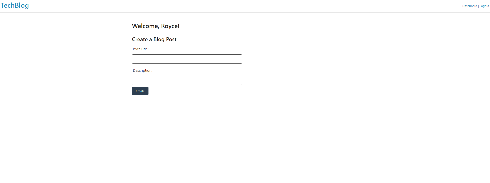
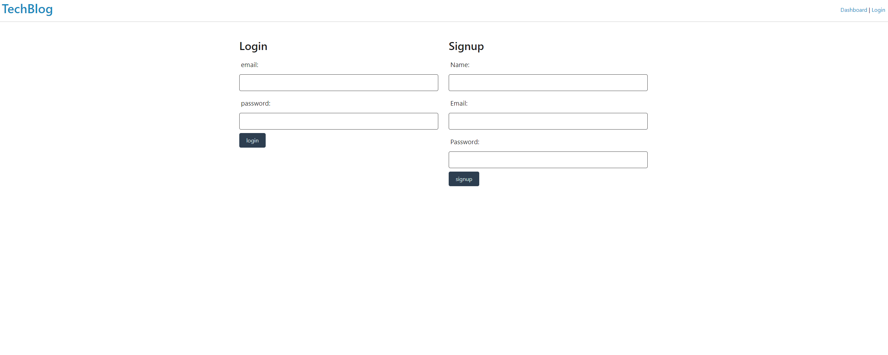
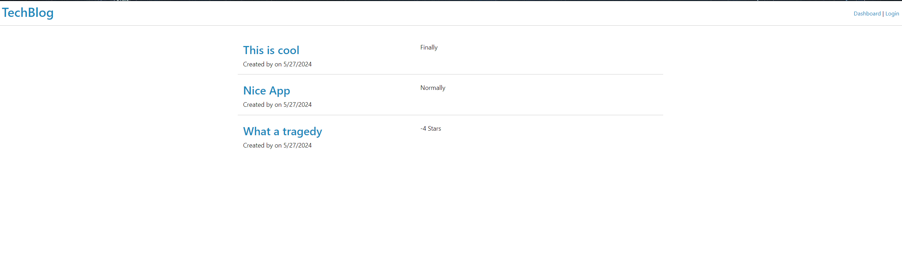

# TechBlog
## Overview
Welcome to TechBlog, a modern and feature-rich blogging platform designed for tech enthusiasts. Created by Royce Atkins, TechBlog offers a seamless user experience for creating, reading, and commenting on blog posts. Whether you're a developer, designer, or just someone interested in tech, TechBlog is the perfect place to share your thoughts and stay updated with the latest trends.

# Table of Contents
- [Features](#features)
- [Technologies Used](#technologies_used)
- [Installation](#installation)
- [Usage](#usage)
- [Contributing](#contributing)
- [License](#license)
- [Acknoledgements](#acknowledgements)
- [Contact](#contact)
## Features
User Authentication: Secure login and registration using JWT and bcrypt.
CRUD Operations: Full CRUD (Create, Read, Update, Delete) functionality for blog posts.
Comments: Users can comment on posts and engage in discussions.
Responsive Design: Fully responsive design ensuring accessibility across all devices.
User Profiles: Personalized user profiles showcasing user-specific posts and comments.

## Technologies Used
### Backend:

Node.js
Express.js
Sequelize (ORM)
PostgreSQL
JWT (JSON Web Tokens) for authentication
bcrypt for password hashing
### Frontend:

HTML5
CSS3
JavaScript
Handlebars.js (Templating engine)
## Installation
### Prerequisites
Before you begin, ensure you have the following installed:

Node.js
PostgreSQL

### Steps
Clone the repository:

Copy code
`git clone https://github.com/royceatkins/techblog.git`
`cd techblog`
Install dependencies:

Copy code
`npm install`
Set up the database:

Create a .env file in the root directory and add your MySQL database credentials:

Copy code

`DB_NAME='techblog_db'`
`DB_USER='your_username'`
`DB_PASSWORD='your_password'`
`DB_HOST='localhost'`
`DB_PORT=3001`
Run the database seed:

`npm run seed` 
Start the server:

Copy code
`npm run start`
Open your browser:

Visit http://localhost:3001 to access the TechBlog site.
## Usage
### Creating an Account
Navigate to the Sign-Up page to create a new account.
Provide your username, email, and password to register.
### Writing a Blog Post
After logging in, navigate to the dashboard.
Click "New Post" to create a new blog entry.
Fill in the title and content, then save your post.
### Commenting on a Post
Open any blog post to view its content.
Use the comment section at the bottom to add your thoughts.

#### Screenshots

## Contributing
Contributions are welcome! If you'd like to contribute, please follow these steps:

Fork the repository.
Create a new branch (git checkout -b feature-branch).
Commit your changes (git commit -m 'Add new feature').
Push to the branch (git push origin feature-branch).
Open a pull request.
## License
This project is licensed under the MIT License. See the LICENSE file for details.

## Acknowledgements
Express.js
Sequelize
Handlebars.js
MySQL
## Contact

For any inquiries or questions, please contact Royce Atkins at royceatkins93@gmail.com.
My github repo: https://github.com/Wartech93/Royce-s-TechBlog.git
Thank you for using TechBlog! We hope you enjoy sharing and reading amazing tech content.

Feel free to adjust any details as per your project's actual setup and requirements.